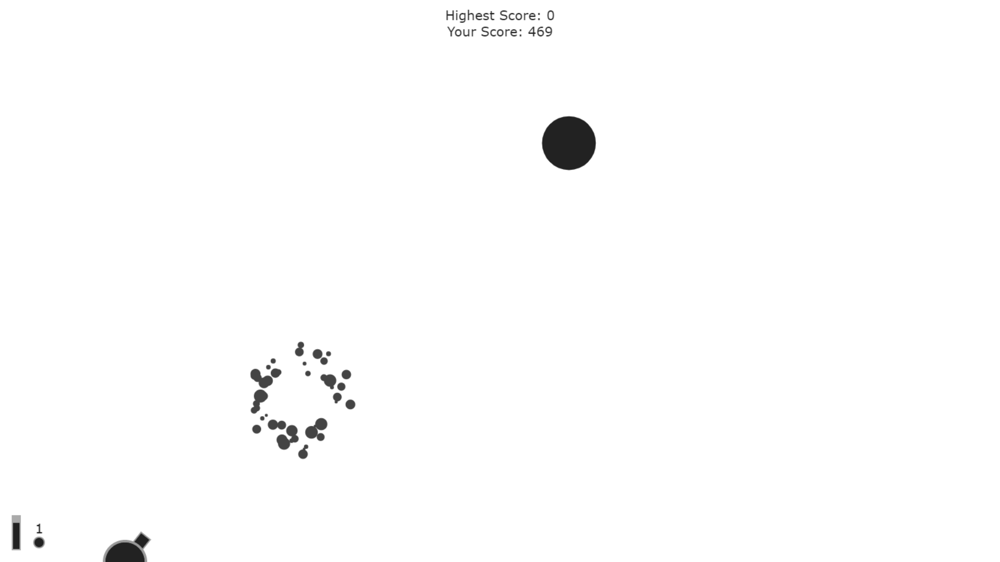

# Cannon Fire - JS Game
Ballistics/projectile canon game using JS with mouse interactable dragging and particle system for explosion. You are given a canon to destroy your targets. Destroy everything!

	

## LIVE DEMO

	
	
## Tech/Libraries Used.
- HTML
- JS
- <a href="https://github.com/dioveath/teengine-js">Teengine JS</a>
- Netlify
